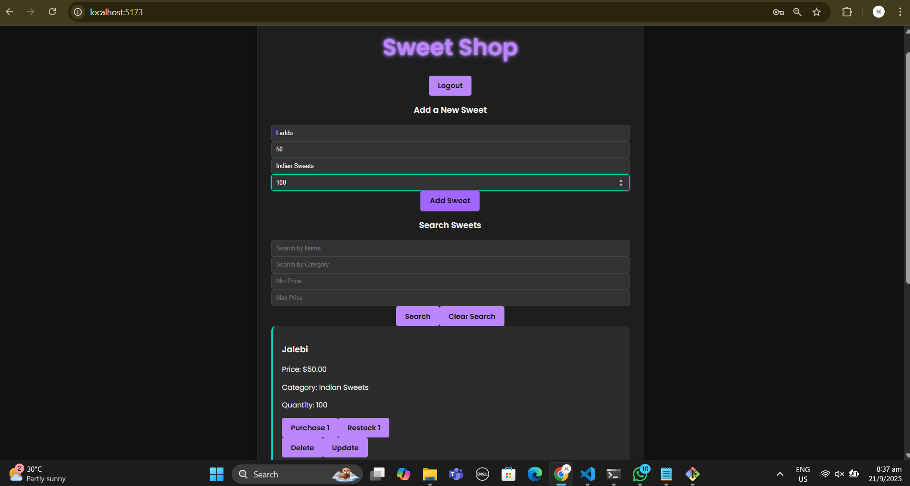
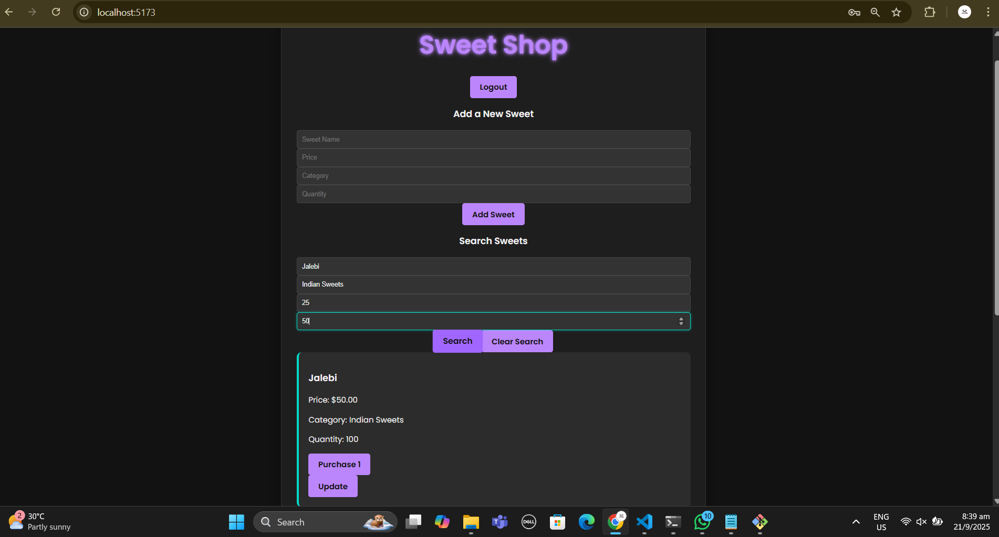

# Sweet Shop - My Awesome Project

## Project Overview
This project is a simple full-stack web application for a sweet shop management system. It allows users to view available sweets, purchase them, and provides special administrative access for managing the sweets.

## Features

- **User Authentication**: Users can register and log in to the application.
- **Admin Access**: An admin user has special permissions to restock, delete, and add new sweets.
- **Product Management**:
    - Users can see a list of all sweets.
    - Users can purchase sweets, which decreases the quantity.
    - Admins can add new sweets, restock existing sweets, and delete sweets.

## Technologies Used

### Frontend (React)
- **React**: For building the user interface.
- **Vite**: For a fast development environment.
- **State Management**: Using React's `useState` and `useEffect` hooks.

### Backend (Python)
- **FastAPI**: For creating the backend API.
- **SQLAlchemy**: For database management (ORM).
- **SQLite**: The database is stored in a `sweets.db` file.
- **Passlib**: For password hashing.
- **python-jose**: For handling JWT tokens.

## How to Run the Project

1.  **Clone the Repository**
    ```bash
    git clone <https://github.com/ThulasiGopinath/KATA-Sweet-Shop-Management-System.git>
    ```

2.  **Setup Backend**
    - Navigate into the backend directory:
      ```bash
      cd KATA/backend
      ```
    - Activate the virtual environment:
      - For Mac/Linux: `source venv/bin/activate`
      - For Windows (Git Bash): `source venv/Scripts/activate`
    - Start the backend server:
      ```bash
      uvicorn main:app --reload
      ```

3.  **Setup Frontend**
    - Open a new terminal and navigate to the frontend directory:
      ```bash
      cd KATA/frontend
      ```
    - Install dependencies:
      ```bash
      npm install
      ```
    - Start the frontend development server:
      ```bash
      npm run dev
      ```

4.  **Usage**
    - Open your browser and go to `http://localhost:5173`.
    - Register a user with the username 'admin' to test the admin features.
    - Register other users to test the regular user features.


## Final Application Screenshots

### Admin Dashboard


### Normal User Dashboard


## My AI Usage

Throughout this project, I used Gemini, a large language model from Google, as a coding assistant. This collaboration was crucial for successfully completing the project, particularly in the following ways:

* **Initial Boilerplate Code**: I used Gemini to generate the initial code for the FastAPI backend. This included setting up the basic API endpoints for user registration, login, and sweet management, which gave me a solid foundation to build upon.
* **Debugging and Error Resolution**: When I encountered difficult bugs, especially with the database connection and the `is_admin` functionality, I described the issues to Gemini. The assistant provided clear explanations and code snippets to help me identify and correct logical errors in both the frontend (`App.jsx`) and backend (`main.py`) files.
* **Code Structure and Best Practices**: I received guidance on how to structure my project files, use environment variables for sensitive data, and apply modern JavaScript features for state management.
* **Documentation and Project Setup**: Gemini helped me create a comprehensive `README.md` file with detailed setup instructions for both the frontend and backend, which is essential for project handoff.

My reflection on this experience is that AI tools can significantly enhance a developer's workflow, acting as a powerful resource for problem-solving and accelerating development. However, it's crucial to understand the code generated by the AI and manually verify it to ensure accuracy and meet specific project requirements.

